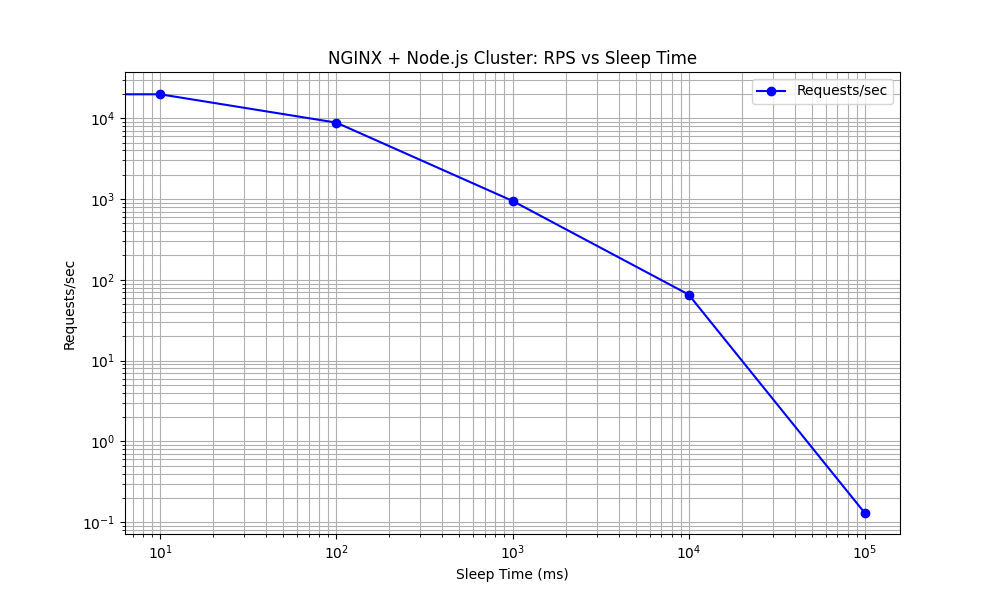

# NodeJs/Express performance baseline measure

Recently (Dec, 2023), I took on the role of Project Lead for the Search UI at [SciCat](https://github.com/scicatproject), a widely recognized scientific metadata catalog. Diving into this role, my journey isn't just about exploring the complex layers of its codebase. I also initiated a comprehensive benchmarking exercise. This not only helps me carve out a solid performance baseline but also sheds light on vital insights for future capacity planning, ensuring our system's readiness for scaling and evolving needs. 

To ensure my benchmarks accurately reflect real-world usage, all tests were performed on a typical single-instance virtual machine, armed with **8 CPU cores** and **12 GB RAM** - a standard environment that mirrors our production setup. 

The heart of these tests was a simple, custom-built Node.js [application](index.js), mirroring the core technology of SciCat.

Leveraging [wrk2](https://github.com/giltene/wrk2), a powerful HTTP benchmarking tool, I tested various aspects of the application. This included measuring the response times for a basic 'Hello World' response, and more complex scenarios involving **CPU time (cpuTime)** and simulated **I/O operations (sleepTime)**. These tests were performed against both a single node instance and an NGINX-balanced Node.js cluster.

To set a performance baseline, I also benchmarked NGINX serving static content. This gives a comparative perspective on how my Node.js setup fares against NGINX's highly optimized static file serving capabilities.

Here's a snapshot of how my application responded under various test conditions:

**Hello World Response:** Serving as our control scenario, the simple 'Hello World' endpoint efficiently handled requests against `wrk -R{1000..10000} -t10 -c1000 -d30`, setting a 5K requests per second (RPS) standard for responsiveness and throughput:

**CPU Time (cpuTime):** Introducing computational load through cpuTime={0..1_000} provides a window into how CPU-bound operations impact performance. As expected, the performance degrades dramatically, reflecting the computational overhead and the single-threaded nature of Node.js:

**Simulated I/O (sleepTime):** Mimicking I/O operations with sleepTime={0..10_000} shows the asynchronous prowess of Node.js. The results highlighted the platform's ability to manage I/O-bound tasks, a critical factor for applications heavily reliant on database interactions or external API calls. However, performance does not degrade as fast as with CPU bound exercise, still anything beyond 10ms must be carefully considered:

These tests, conducted in isolation on a single Node.js instance, served as a baseline, illustrating the inherent capabilities and limitations of the setup before scaling out or implementing any optimizations. 

Before going further with scaling my Node.js app in a [cluster](bin/nodejs_cluster.sh), I checked a baseline with the NGINX's most powerful feature – serving static content. This test reaffirmed NGINX's prowess as a high-performance static file server, delivering an outstanding rate of 200K requests per second even against `wrk -R250000 -t200 -c1000`. This benchmark sets a high bar and offered a clear performance reference point against which to measure the dynamic content serving capabilities of our Node.js application:

## NGINX as a Reverse Proxy for Node.js Cluster

Transitioning from static to dynamic, I integrated NGINX as a reverse proxy in front of a Node.js cluster. Here is its [config file](conf/nginx.conf). Thanks to @denji for very useful [tips](https://gist.github.com/denji/8359866) on tuning NGINX. This setup aimed to harness the strengths of both NGINX's efficient request handling and Node.js's non-blocking architecture. The results of ~22K were self explaning:

**Load Balancing:** NGINX adeptly distributed incoming from `wrk -R25000 -t{25..200} -c1000` requests across the Node.js cluster, showcasing its effectiveness in load balancing and its pivotal role in scaling applications:

**Performance with Node.js Cluster:** When NGINX fronted the Node.js cluster, there was a noticeable impact on throughput. The performance metrics show `cpuTime` case still degrades significantly, while `sleepTime` performs significantly better than a single instance case:

This last figure shows CPU load while performing various tests. With NGINX and NodeJs cluster setup in `cpuTime` test CPU consumption easily raised to 100%:

## Summary

These insights were instrumental in understanding the interplay between NGINX and Node.js in a clustered environment and set the stage for further optimization and capacity planning in my project. All the relevant files are presented in this GitHub repository.

